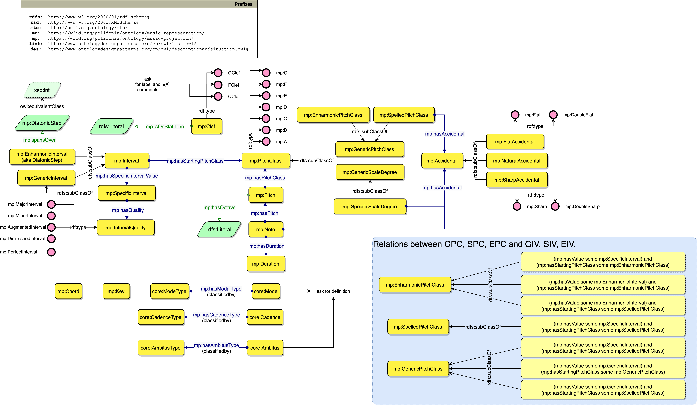
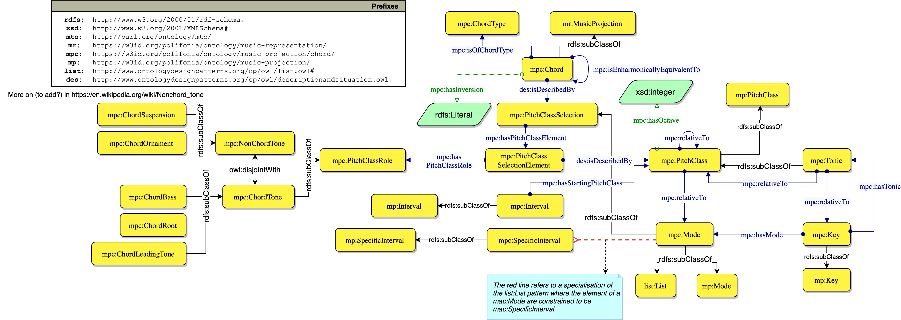

# Music Projection Ontology
Ontology for describing music notation elements.

The Music Projection module formalises musical entities that can be subject of an annotation. This ranges from traditional musical notation (e.g. note, chords) to informal annotations (e.g. mood, danceability). The module is aligned with MusicOWL, Music Notation Ontology, Music Note Ontology, Music Theory Ontology [1], Chord Ontology [2], and our [`Roman Chord`](https://github.com/polifonia-project/roman-chord-ontology) Ontology. This allows to integrate existing domain ontologies. Notably, we also harmonise different chord representations (Chord Ontology, the Roman Chord Ontology and the Tonality Ontology) based on the Unified Model of Chords in Western Harmony [3].

## License

This work is licensed under a [Creative Commons Attribution 4.0 International License][ http://creativecommons.org/licenses/by/4.0/].

## References

[1]: Rashid, S.M., De Roure, D., McGuinness, D.L.: A music theory ontology. In: Pro- ceedings of the 1st International Workshop on Semantic Applications for Audio and Music. p. 6–14. SAAM ’18, Association for Computing Machinery, New York, NY, USA (2018).

[2]: Fazekas, G., Raimond, Y., Jacobson, K., Sandler, M.: An overview of semantic web activities in the omras2 project. Journal of New Music Research 39 (12 2010).

[3]: Hentschel, J., Moss, F.C., McLeod, A., Neuwirth, M., Rohrmeier, M.: Towards a Unified Model of Chords in Western Harmony. In: Münnich, S., Rizo, D. (eds.) Music Encoding Conference Proceedings 2021. pp. 143–149. Humanities Commons (2022).