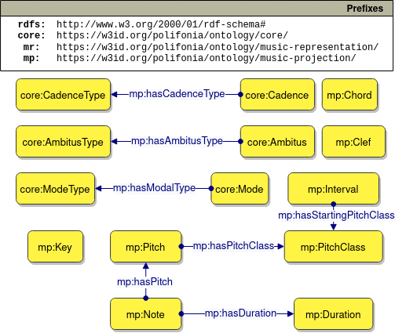

# Music Projection Ontology
The Music Projection Ontology allows the formalisation of the musical entities that can be the subject of an annotations. 
This ranges from traditional musical notation (e.g. note, chords) to informal annotations (e.g. mood, danceability).

The ontology is aligned to similar domain-specific ontologies: Chord ontology [1], MusicOWL [2], Music Theory Ontology [3], Music Note Ontology [4], Roman chord ontology [5], Music Notation ontology [6] and Tonality ontology [1].

## Core concepts
A set of general concepts has been identified. Those are then extended by other modules which model a specific interepretation of a concept.
That is because some projections, for instance the concept of *Mode*, changes when interpreted using modern western music theory or thories from the reinassance.
The general definition of a projection allows flexible extensions while retaining a fundamental alignment that allows different theories to be interoperable.

This ontology is hence provides the ground work for an upper ontology on music concepts that can be of interest from an analytical point of view. It is exprected to grow as more specialisation are produced.

In the Figure above the main set of concepts that are more commonly extended by other ontologies are represented.

## License

This work is licensed under a
[Creative Commons Attribution 4.0 International License][cc-by].

[cc-by]: http://creativecommons.org/licenses/by/4.0/

## References

[1] Fazekas, G., Raimond, Y., Jacobson, K., & Sandler, M. (2010). An overview of semantic web activities in the OMRAS2 project. Journal of New Music Research, 39(4), 295-311.

[2] Jones, J., de Siqueira Braga, D., Tertuliano, K., & Kauppinen, T. (2017, August). Musicowl: The music score ontology. In Proceedings of the International Conference on Web Intelligence (pp. 1222-1229).

[3] Rashid, S. M., De Roure, D., & McGuinness, D. L. (2018, October). A music theory ontology. In Proceedings of the 1st International Workshop on Semantic Applications for Audio and Music (pp. 6-14).

[4] Poltronieri, A., & Gangemi, A. (2021). The Music Note Ontology. In Proceedings of the 12th Workshop on Ontology Design and Patterns (WOP 2021), Online, October 24, 2021.

[5] https://github.com/polifonia-project/roman-chord-ontology

[6] Cherfi, S. S. S., Guillotel, C., Hamdi, F., Rigaux, P., & Travers, N. (2017, December). Ontology-based annotation of music scores. In Proceedings of the Knowledge Capture Conference (pp. 1-4).
