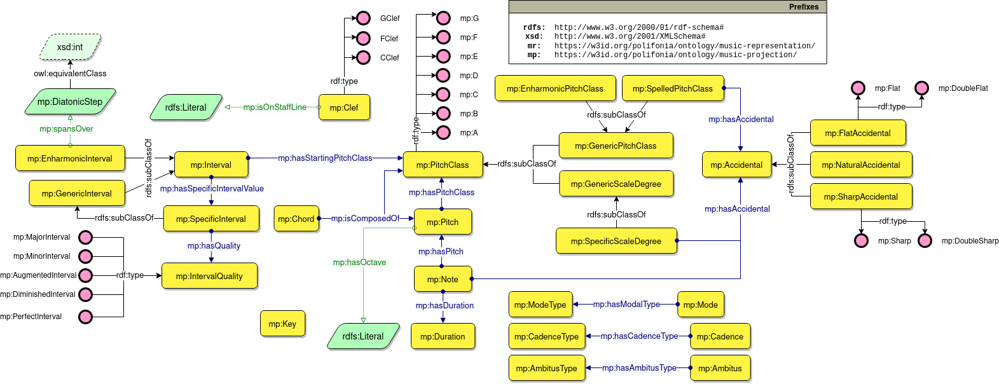

# Music Projection Ontology
[](https://zenodo.org/badge/latestdoi/372536364)
[](https://creativecommons.org/licenses/by/4.0/)

The Music Projection Ontology allows the formalisation of the musical entities that can be the subject of an annotations. 
This ranges from traditional musical notation (e.g. note, chords) to informal annotations (e.g. mood, danceability).

> 🔗 Ontology URI: [https://w3id.org/polifonia/ontology/music-projection/](https://w3id.org/polifonia/ontology/music-projection/)



### General projections
A set of general concepts has been identified. Those are then extended by other modules which model a specific interepretation of a concept.
That is because some projections, for instance the concept of *Mode*, changes when interpreted using modern western music theory or thories from the reinassance.
The general definition of a projection allows flexible extensions while retaining a fundamental alignment that allows different theories to be interoperable.

This ontology is hence provides the ground work for an upper ontology on music concepts that can be of interest from an analytical point of view. It is exprected to grow as more specialisation are produced.


In the Figure above the main set of concepts that are more commonly extended by other ontologies are represented.
The definition of Note, PitchClass and Interval is an implementation of the model defined in [7].
A graphical representation is depicted below.


The expressivity of OWL allows the formalisation of the relation between a pitch class and an interval, as restrictions. In in the Figure below the restrictions are depicted. An in-depth explanation is given in [7].


## Competency questions addressed
The ontology follows the [eXtreme Design](http://extremedesign.info/) methodology for ontology development. A set of competency questions have been extracted from similar works and are listed below, alongside their provenance.

| ID | Competency question                                                                                       | Reference               |
|----|-----------------------------------------------------------------------------------------------------------|-------------------------|
| 1  | What are the dynamic indications referring to a note in the score?                                        | Music Note Ontology [4] |
| 2  | Which are the accidental of the notes present in a score part?                                            | Music Note Ontology [4] |
| 3  | Which are the compositions containing chords composed of X notes?                                         | MusicOWL [2]            |

## Examples of SPARQL queries

CQ1 - Assuming a note ?note
```
PREFIX rdfs: <http://www.w3.org/2000/01/rdf-schema#>
PREFIX core: <https://w3id.org/polifonia/ontology/core/>
PREFIX mr: <https://w3id.org/polifonia/ontology/music-representation/>
PREFIX mso: <http://linkeddata.uni-muenster.de/ontology/musicscore#>

SELECT ?dynamic_label
WHERE { 
  BIND(<Note> as ?note ) .
  
  [] mr:hasObservation [ 
    mr:hasSubject ?note ;
    mr:hasSubject [
      a mso:Dynamic ;
      rdfs:label ?dynamic_label .
    ]
  ] .
}
```

CQ2 - Assuming the score part is identified in the fragment ?fragment
```
PREFIX rdfs: <http://www.w3.org/2000/01/rdf-schema#>
PREFIX core: <https://w3id.org/polifonia/ontology/core/>
PREFIX mr: <https://w3id.org/polifonia/ontology/music-representation/>
PREFIX mp: <https://w3id.org/polifonia/ontology/music-projection/>

SELECT ?note_label ?accidental_label
WHERE { 
  BIND(<Fragment> as ?fragment ) .
  
  ?ann mr:described ?fragment ;
       mr:hasObservation [
        a mp:Note ;
        rdfs:label ?note_label
       ] ;
       mr:hasObservation [
        a/rdfs:subClassOf* mp:Accidental ;
        rdfs:label ?accidental_label
       ] ;
}
```

CQ3 - Assuming X is the number of notes
```
PREFIX rdfs: <http://www.w3.org/2000/01/rdf-schema#>
PREFIX core: <https://w3id.org/polifonia/ontology/core/>
PREFIX mr: <https://w3id.org/polifonia/ontology/music-representation/>
PREFIX mp: <https://w3id.org/polifonia/ontology/music-projection/>

SELECT ?composition
WHERE { 
  ?composition mr:hasAnnotation [
    mr:hasObservation [
      mr:hasSubject ?chord
    ] 
  ] .

  ?chord a mp:Chord ;
         mp:isComposedOf ?note .
}
GROUP BY ?chord
HAVING COUNT(?note) = X
```

## Imported ontologies

### Direct imports
- [Core](https://w3id.org/polifonia/ontology/core)
- [Music Representation](https://w3id.org/polifonia/ontology/music-representation)

## Aligned ontologies
- Chord ontology [1]
- MusicOWL [2]
- Music Theory Ontology [3]
- Music Note Ontology [4]
- Roman chord ontology [5]
- Music Notation ontology [6]
- Tonality ontology [1]


## Statistics
- number of classes: 163 
- number of object properties: 154
- number of datatype properties: 20
- number of logical axioms: 686

## License

This work is licensed under a [Creative Commons Attribution 4.0 International License](http://creativecommons.org/licenses/by/4.0/).

## References

[1] Fazekas, G., Raimond, Y., Jacobson, K., & Sandler, M. (2010). An overview of semantic web activities in the OMRAS2 project. Journal of New Music Research, 39(4), 295-311.

[2] Jones, J., de Siqueira Braga, D., Tertuliano, K., & Kauppinen, T. (2017, August). Musicowl: The music score ontology. In Proceedings of the International Conference on Web Intelligence (pp. 1222-1229).

[3] Rashid, S. M., De Roure, D., & McGuinness, D. L. (2018, October). A music theory ontology. In Proceedings of the 1st International Workshop on Semantic Applications for Audio and Music (pp. 6-14).

[4] Poltronieri, A., & Gangemi, A. (2021). The Music Note Ontology. In Proceedings of the 12th Workshop on Ontology Design and Patterns (WOP 2021), Online, October 24, 2021.

[5] https://github.com/polifonia-project/roman-chord-ontology

[6] Cherfi, S. S. S., Guillotel, C., Hamdi, F., Rigaux, P., & Travers, N. (2017, December). Ontology-based annotation of music scores. In Proceedings of the Knowledge Capture Conference (pp. 1-4).

[7] Hentschel, J., Moss, F. C., McLeod, A., Neuwirth, M., & Rohrmeier, M. (2022). Towards a unified model of chords in western harmony.
